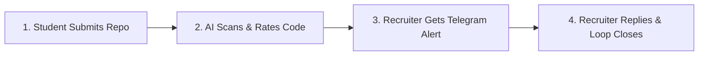
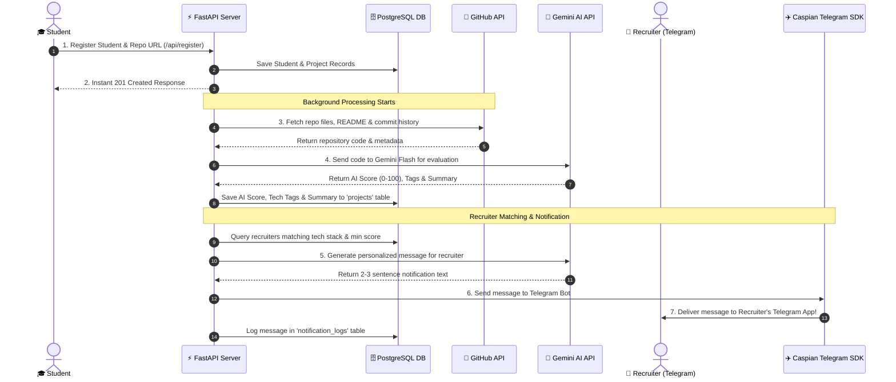
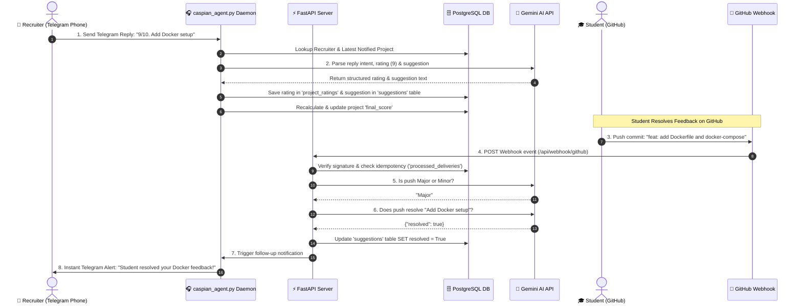

# 🔄 TalentCaspian — Data Flow & API Architecture Guide (Visual & Simplified)

Welcome to the **TalentCaspian Architecture Guide**! This document explains in clear, visual, and non-overly-technical terms:
1. **How data flows** through the system.
2. **Where information is stored** in the database.
3. **When API calls happen** (GitHub, Google Gemini AI, Telegram).

---

## 🌟 1. The Big Picture: How TalentCaspian Works in 4 Steps

1. **Student Registers**: A student signs up with their GitHub repository link.
2. **Agent 1 (Portfolio Scanner)**: Fetches code from GitHub and uses Google Gemini AI to evaluate code quality (0–100 score) and extract tech tags (e.g. `python`, `fastapi`).
3. **Agent 2 (Recruiter Matcher)**: Matches high-quality projects with recruiters based on tech preferences and sends a personalized alert to the recruiter's Telegram app.
4. **Agent 3 (Recruiter Reply Listener)**: Recruiter replies directly on Telegram with a rating (e.g. `9/10`) or suggestion (`"Add Docker setup"`). When the student fixes it on GitHub, TalentCaspian automatically detects the fix and alerts the recruiter!

---

## 🔄 2. Complete Data Flow & API Call Diagrams

### Diagram A: From Student Registration to Recruiter Telegram Alert

---

### Diagram B: Recruiter Telegram Reply & Automatic Code Push Resolution Loop

---

## 🗄️ 3. Where Information Gets Saved (PostgreSQL Tables Made Simple)

TalentCaspian stores data in **7 easy-to-understand database tables**:

| Table Name | What it Stores | Key Fields |
| :--- | :--- | :--- |
| 🧑‍🎓 **`students`** | Student profile details | Student ID, Name, Email, GitHub Username |
| 📁 **`projects`** | Portfolio projects & AI quality scores | Project ID, Student ID, GitHub Repo URL, AI Score, Final Score, Tech Tags, Summary |
| 👔 **`recruiters`** | Recruiter profiles & hiring preferences | Recruiter ID, Name, Email, Channel (`telegram`), Preferred Tech Stack & Min Score |
| ⭐ **`project_ratings`** | 1 to 10 ratings given by recruiters & peers | Rating ID, Project ID, Rater Type, Rating Score (1-10) |
| 💡 **`suggestions`** | Recruiter feedback & code improvement notes | Suggestion ID, Project ID, Recruiter ID, Feedback Text, Resolved (`true`/`false`) |
| 📜 **`notification_logs`** | History of sent alerts (prevents spamming) | Log ID, Recruiter ID, Project ID, Channel, Message Text, Sent Timestamp |
| 🔒 **`processed_deliveries`**| GitHub webhook IDs (prevents duplicate pushes) | Delivery UUID, Processed Timestamp |

---

## 🌐 4. When API Calls Happen

### A. Internal API Endpoints (Used by Frontend & Admin)

- **`POST /api/register`**: Registers a student and triggers background GitHub code scanning.
- **`GET /api/dashboard`**: Fetches portfolio projects for the student dashboard.
- **`POST /api/rate`**: Allows peers to rate a project 1-10.
- **`POST /api/recruiter/register`**: Saves recruiter hiring preferences.
- **`POST /api/admin/notify`**: Triggers recruiter matching and sends Telegram alerts.
- **`POST /api/webhook/github`**: Receives GitHub push notifications when students update code.

---

### B. External API Calls (Connected Third-Party Services)

#### 1. GitHub API (`https://api.github.com`)
- **When it runs**: When a student registers or pushes new code to GitHub.
- **What it does**: Reads directory files, README content, and commit messages.

#### 2. Google Gemini AI API (`google-genai` SDK)
- **When it runs**: 
  - Evaluating code quality (`ai_score` 0-100).
  - Generating personalized recruiter alerts.
  - Parsing Telegram replies (extracting ratings and suggestions).
  - Checking if a GitHub push fixed a recruiter's suggestion.

#### 3. Caspian Telegram SDK (`caspian_sdk`)
- **When it runs**: 
  - Sending outbound Telegram messages to recruiters' phones.
  - Running a background listener (`caspian_agent.py`) to receive incoming Telegram replies.

---

## 📊 5. How Project Scores Work (Simple Math)

A project's quality is represented by two simple scores:

1. **AI Quality Score (0–100)**:  
   $$\text{AI Score} = (40\% \times \text{Difficulty}) + (30\% \times \text{Authenticity}) + (30\% \times \text{Creativity})$$

2. **Final Overall Score (0–100)**:  
   $$\text{Final Score} = (70\% \times \text{AI Score}) + (30\% \times \text{Recruiter/Peer Ratings})$$

This ensures high-quality projects rank top on the recruiter feed!
