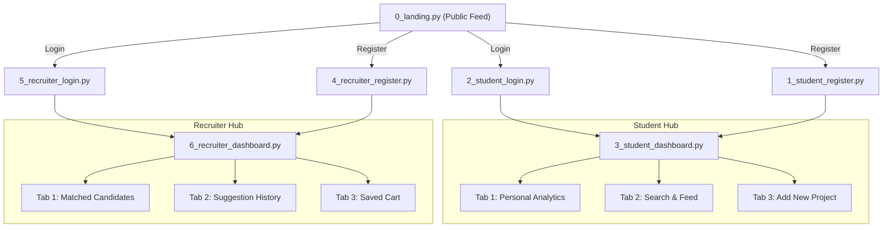

# 🚀 TalentCaspian — Streamlit Frontend Implementation Plan

This plan establishes the architecture, page workflows, UI component design, and API integration for the **TalentCaspian Streamlit Frontend**, translating the layout blueprint in [`FRONTEND_LAYOUT_STREAMLIT_FINAL.md`](file:///D:/mobile/FRONTEND_LAYOUT_STREAMLIT_FINAL.md) into a fully aligned plan matching the existing FastAPI backend.

---

## 🧭 1. Architectural Alignment (Plan vs. Actual Backend)

The table below reconciles the discrepancies between the layout reference and the live FastAPI backend:

| Feature / Action | Reference Layout Assumption | Actual Backend Implementation | Streamlit Frontend Strategy |
| :--- | :--- | :--- | :--- |
| **Authentication** | `POST /api/login` (email/password) | `POST /api/login` with `{"email": str, "user_type": "student" \| "recruiter"}` | Single login endpoint passing the selected `user_type` parameter; session token stored in state & cookie. |
| **Student Projects** | `GET /api/student/{id}/projects` | `GET /api/student/{student_id}` returns `{student, projects, aggregate_stats}` | Fetch student profile and extract the `projects` list and aggregate metrics in one call. |
| **Personal Analytics** | Multiple queries | `GET /api/project/{project_id}/analytics` | Single endpoint returning header, AI score hero, metric breakdown, commits, recruiter interest, suggestions, and AI next steps. |
| **Public Feed & Search** | `GET /api/dashboard` | `GET /api/dashboard` or `GET /api/feed` (supports `page`, `limit`, `search_query`, `tag`, `min_score`, `preview`) | Paginated feed with cached requests and dynamic filtering. |
| **Project Rating** | Rate endpoint | `POST /api/rate` with `{"project_id": int, "rater_type": str, "rating": int}` | 1–10 rating widget for peers and recruiters. |
| **Peer Suggestions** | `POST` to peer table | `POST /api/project/{project_id}/peer-suggestions` | In-dashboard feedback input submitting `{student_id, student_name, feedback_text}`. |
| **Recruiter Preferences** | `PATCH /api/recruiter/{id}/preferences` | `PATCH /api/recruiter/{id}/preferences` with `{"preference_filters": {...}}` | Dedicated "Save Standing Preferences" button in Recruiter Tab 1. |
| **Recruiter Suggestions** | `POST /api/suggest` & `GET /api/recruiter/{id}/suggestions` | `POST /api/suggest` & `GET /api/recruiter/{id}/suggestions` | Modal dialog on candidate cards + Suggestion History review tab. |
| **Recruiter Cart** | `cart_items` endpoints | `GET /api/cart/{id}`, `POST /api/cart`, `DELETE /api/cart/{item_id}` | Persistent wishlist tab with direct remove buttons. |

---

## 📁 2. Frontend Directory Structure

```
d:/mobile/
├── app.py                          # Entry point: st.navigation, global theme, session bootstrapping
├── requirements_frontend.txt       # Streamlit dependencies (streamlit, extra-streamlit-components, plotly, httpx, pandas)
├── utils/
│   ├── __init__.py
│   ├── api_client.py               # Centralized HTTP client (httpx), auth header injection, error handling
│   ├── auth.py                     # Session state management, cookie persistence, role-based guard rails
│   ├── charts.py                   # Plotly charts (Score gauges, rating evolution over time, recruiter interest charts)
│   └── ui_components.py            # Reusable UI widgets (Project cards, Metric badges, AI Recommendation cards)
└── pages/
    ├── 0_landing.py                # Public Landing: Hero, Live Project Feed, Search/Filter, Auth Modal
    ├── 1_student_register.py       # Student Registration Form + Repo Scanner trigger
    ├── 2_student_login.py          # Student Authentication Form
    ├── 3_student_dashboard.py      # Student Hub: Personal Analytics, Search & Feed, Add New Project
    ├── 4_recruiter_register.py     # Recruiter Registration (Channel, Telegram Handle, Tech Filters)
    ├── 5_recruiter_login.py        # Recruiter Authentication Form
    ├── 6_recruiter_dashboard.py    # Recruiter Hub: Recommendations, Suggestion History, Saved Cart
    └── 7_admin_console.py          # Admin/Dev Utility: Trigger AI Scans & Caspian Telegram Notifications
```

---

## 🛠️ 3. Core Infrastructure & Utility Modules

### 3.1 Session & Cookie Persistence (`utils/auth.py`)
Streamlit resets `st.session_state` on browser refresh. To provide a seamless web app experience:
- Use `extra-streamlit-components.CookieManager` to store `auth_token`, `user_type`, and `user_id`.
- On script execution in `app.py`, re-hydrate `st.session_state` from cookies if present.
- Provide helper functions: `login_user(user_data, token)`, `logout_user()`, `require_role(allowed_role)`.

### 3.2 Centralized API Client (`utils/api_client.py`)
- Base URL configured from environment variable `BACKEND_URL` (default: `http://127.0.0.1:8000`).
- Synchronous wrappers around `httpx.Client` for fast Streamlit script execution.
- Automatic header attachment: `Authorization: Bearer <token>` and `X-Admin-API-Key`.
- Streamlit caching via `@st.cache_data(ttl=60)` on GET requests (`fetch_feed`, `fetch_project_analytics`, `fetch_cart`, `fetch_recruiter_matches`).
- Centralized error display via `st.toast` and `st.error`.

### 3.3 Visual Charts & Component Library (`utils/charts.py` & `utils/ui_components.py`)
- **Plotly Score Ring / Hero Gauge**: Displays composite AI score (0–100) with color gradients (Green: 80+, Blue: 60–79, Orange: <60).
- **Rating Evolution Chart**: Dual-series line chart comparing peer vs. recruiter ratings over time.
- **Score Breakdown Bar**: Visual contribution of Difficulty (40%), Authenticity (30%), and Creativity (30%).
- **Project Card Grid**: Clean `st.container(border=True)` cards showing repo tags, summary snippet, AI score badge, and quick action buttons.

---

## 📄 4. Detailed Page Specifications & User Flows



---

### Page 0: Landing & Public Discovery (`0_landing.py`)
- **Header Bar**: Brand logo, tagline ("AI-Powered Autonomous Tech Hiring & Portfolio Intelligence"), and quick action buttons to Student/Recruiter login.
- **Search & Filter Panel**:
  - `st.text_input` for keyword search.
  - `st.selectbox` / `st.multiselect` for tech stack tags (e.g. `fastapi`, `react`, `python`, `postgresql`).
  - `st.slider` for minimum score threshold.
- **Project Grid**: Fetches `GET /api/dashboard?preview=true` (cached).
- **Authentication Gate Dialog**: Clicking a card opens a modal prompting visitors to log in as a Student or Recruiter to view deep analysis or interact with candidates.

---

### Page 1 & 2: Student Registration & Login
- **`1_student_register.py`**:
  - Form fields: Full Name, Email, GitHub Username, Initial Repository URL.
  - Submits to `POST /api/register`.
  - On success, displays confirmation toast and auto-redirects to login with a note that AI repository evaluation is running in the background.
- **`2_student_login.py`**:
  - Form fields: Email address.
  - Submits to `POST /api/login` with `user_type: "student"`.
  - Stores token and student ID into session and browser cookie, then redirects to `3_student_dashboard.py`.

---

### Page 3: Student Dashboard (`3_student_dashboard.py`)
Gated by `require_role("student")`. Divided into 3 high-impact tabs:

#### 🔹 Tab 1: Personal Analytics (Deep-Dive Analysis)
1. **Sticky Project Selector**: Dropdown to toggle between projects belonging to the student (`GET /api/student/{id}`).
2. **AI Rating Hero Banner**:
   - Circular Gauge / Score Ring showing `final_score` (Composite) and `ai_score`.
   - Score Delta indicator (e.g., `+4.5 pts from peer ratings`).
3. **Score Breakdown Contribution Bars**:
   - Technical Quality / Difficulty ($40\%$)
   - Code Authenticity ($30\%$)
   - Project Creativity ($30\%$)
   - Community & Recruiter Ratings ($30\%$ of composite)
4. **Project Evolution & Trajectory**:
   - Plotly line graph: Rating changes over time (Peer vs. Recruiter).
   - Recent Commits table (`GET /api/project/{id}/commits`) highlighting Major vs. Minor classifications.
5. **Recruiter Market Fit**:
   - Total matching recruiter count.
   - Tech stack demand distribution chart.
6. **Recruiter Suggestions & Feedback**:
   - Expandable cards showing feedback received.
   - Status badge: `Resolved (Verified on GitHub)` vs. `Open Action Required`.
7. **AI Actionable Next Steps**:
   - Top 3 recommendations generated by Gemini AI with expected score impact (High/Medium/Low).

#### 🔹 Tab 2: Search & Community Feed
- Browse public student projects (`GET /api/dashboard`).
- Peer Rating submission widget (`POST /api/rate` with `rater_type: "public"`).
- Peer suggestion thread: Submit constructive feedback (`POST /api/project/{id}/peer-suggestions`) and view community commentary.

#### 🔹 Tab 3: Add New Project
- Form to submit an additional GitHub repository URL (`POST /api/projects`).
- Enqueues background scan; displays progress indicator and auto-refreshes when initial AI scoring finishes.

---

### Page 4 & 5: Recruiter Registration & Login
- **`4_recruiter_register.py`**:
  - Form fields: Recruiter Name, Work Email, Preferred Channel (`email` or `telegram`), Telegram Handle (if telegram selected), Hiring Preferences (Target Tech Stack tags, Minimum Quality Score).
  - Submits to `POST /api/recruiter/register`.
- **`5_recruiter_login.py`**:
  - Submits to `POST /api/login` with `user_type: "recruiter"`.
  - Persists session and redirects to `6_recruiter_dashboard.py`.

---

### Page 6: Recruiter Dashboard (`6_recruiter_dashboard.py`)
Gated by `require_role("recruiter")`. Divided into 3 operational tabs:

#### 🔹 Tab 1: Matched Candidates & Discovery
- **Standing Preferences Banner**: Displays the recruiter's active notification filter for automated Telegram/Email alerts.
- **In-App Filter Controls**: Dynamic tech stack multiselect and minimum score slider for interactive browsing (`GET /api/dashboard`).
- **"Save as My Standing Preferences" Button**: Persists current filters to backend via `PATCH /api/recruiter/{id}/preferences`.
- **Candidate Cards**:
  - Displays summary, AI scores, tech tags, and author info.
  - Action 1: **"Add to Cart / Shortlist"** (`POST /api/cart`).
  - Action 2: **"Send Feedback / Suggestion"** (Opens modal -> `POST /api/suggest`).

#### 🔹 Tab 2: Suggestion History & Replies
- Fetches all suggestions submitted by the recruiter (`GET /api/recruiter/{id}/suggestions`).
- Shows candidate project, feedback text, submission date, and live resolution status (`Resolved via GitHub push` / `Pending`).
- Manual refresh trigger button to clear cache and re-check webhook-driven resolutions.

#### 🔹 Tab 3: Candidate Shortlist (Cart)
- Fetches saved cart items (`GET /api/cart/{recruiter_id}`).
- Card list of bookmarked candidates with one-click GitHub repo links and remove buttons (`DELETE /api/cart/{item_id}`).

---

### Page 7: Admin & Developer Console (`7_admin_console.py`)
- Utility tool for hackathon demonstrations:
  - Trigger immediate AI repository re-scan (`POST /api/admin/scan`).
  - Trigger Caspian multi-channel recruiter Telegram alert matching (`POST /api/admin/notify`).
  - GitHub Webhook simulator to test commit push re-evaluations and auto-resolution loops.

---

## 🗓️ 5. Step-by-Step Implementation Roadmap

| Step | Scope | Deliverables |
| :--- | :--- | :--- |
| **Phase 1: Setup & Core Utilities** | `requirements_frontend.txt`, `utils/api_client.py`, `utils/auth.py` | Centralized API client, session management, cookie persistence, base stylesheet. |
| **Phase 2: UI Component & Chart Engine** | `utils/charts.py`, `utils/ui_components.py` | Plotly score gauges, rating timelines, score contribution bars, reusable candidate cards. |
| **Phase 3: Public Landing & Auth Flow** | `app.py`, `0_landing.py`, `1_student_register.py`, `2_student_login.py`, `4_recruiter_register.py`, `5_recruiter_login.py` | Role-based navigation, discovery feed with filters, registration & login forms with cookie persistence. |
| **Phase 4: Student Dashboard (3 Tabs)** | `pages/3_student_dashboard.py` | Personal Analytics tab (Hero score, metrics, trajectory, recruiter signal, suggestions, AI next steps), Search & Feed tab, Add Project tab. |
| **Phase 5: Recruiter Dashboard (3 Tabs)** | `pages/6_recruiter_dashboard.py` | Matched Candidates tab, Suggestion submission modal, Preference updating, Suggestion History tab, Persistent Cart tab. |
| **Phase 6: Admin Console & Polish** | `pages/7_admin_console.py`, styling review, E2E testing | Dev trigger console, responsive CSS adjustments, cache invalidation verification. |

---

## 🔒 6. Key Frontend Safeguards & Performance Best Practices

1. **No Redundant Re-renders**: All read operations wrapped in `@st.cache_data(ttl=60)` with explicit cache clearing (`st.cache_data.clear()`) on mutations (e.g. rating a project, submitting feedback, adding to cart).
2. **Defensive Role Guards**: Every gated page checks `st.session_state.get("role")` at the very top line; if unauthorized, it displays a warning and calls `st.stop()`.
3. **Graceful Loading & Polling**: Display clear spinners (`st.spinner("AI evaluating repository...")`) for background-queued actions without blocking the UI thread.
4. **Clean Error Boundaries**: Display user-friendly error banners when the backend API is unreachable or returns a 4xx/5xx status.
