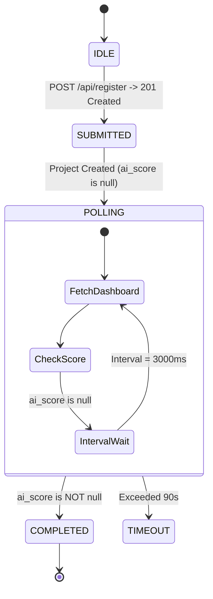
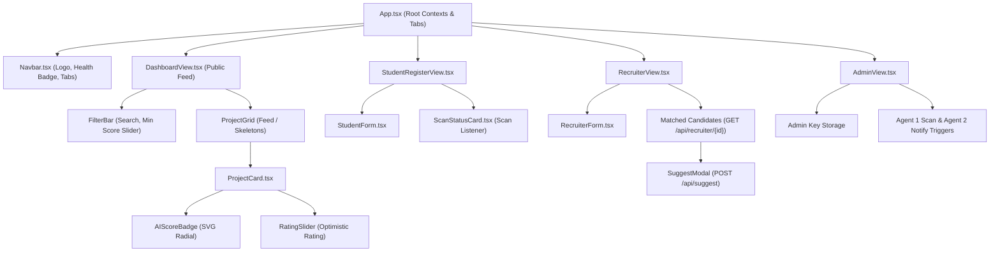

# 🚀 TalentCaspian — End-to-End Frontend Architecture & Refined Implementation Plan

> **Project Name**: TalentCaspian Frontend Web Application  
> **Author**: Antigravity AI Engineering Team (Multi-Agent Refined)  
> **Target Date**: August 2026  
> **File Location**: `D:\mobile\TalentCaspian_Frontend_Plan.md`  

---

## 🎯 1. Executive Summary & Refined Vision

The goal of this task is to design, construct, and integrate a **sleek, responsive, accessible, and robust frontend web application** for **TalentCaspian** (the AI-driven developer portfolio scanner and recruiter matching system). 

This plan has been thoroughly refined across **three specialized agency perspectives**:
1. **Frontend Architecture (`agency-frontend-developer`)**: State hierarchy, finite-state background AI scan polling, debounced search feeds, Bayesian score optimistic updates with rollback, and loading skeletons.
2. **UI/UX & Visual Finish (`agency-ui-designer`)**: Dark-slate glassmorphism design tokens, SVG circular AI score indicators, micro-interactions, WCAG 2.1 AA accessibility compliance, and mobile responsive grid collapse.
3. **API Platform Integration (`agency-api-platform-engineer`)**: 1:1 TypeScript contract alignment with FastAPI Pydantic models, dual-mode 422 validation parsing, 409 conflict IP handling, Axios interceptors, Vite proxying, and visibility-aware `/health` polling.

---

## 🛠️ 2. Tech Stack Selection & Architectural Rationale

To comply with project standards defined in `RULE[D:\mobile\.agents\AGENTS.md]` and modern web development best practices, we select:

| Layer | Technology | Rationale |
| :--- | :--- | :--- |
| **Core Framework** | **Vite + React 18 (TypeScript)** | Lightning-fast HMR, zero bundle bloat, strict type safety mapped 1:1 to Pydantic models. |
| **Styling** | **Tailwind CSS (v3/v4) + Vanilla CSS Variables** | Adheres strictly to project rules (`Use Tailwind CSS classes for styling. Avoid writing custom inline CSS`). Enables responsive design with zero specificity issues. |
| **Iconography** | **Lucide-React** | Accessible visual icons matching tech tags, scores, GitHub links, and rating stars. |
| **API Client** | **Axios + Typed Interceptors** | Custom `src/services/apiClient.ts` with error normalization, automatic `X-Admin-API-Key` injection, and retry wrapper. |
| **State Management** | **React Context + Custom Hooks** | Minimalist state hierarchy following Karpathy simplicity principles — avoiding over-engineered Redux/Zustand boilerplate while maintaining modularity. |
| **Dev Server & Proxy** | **Vite Proxy** | Maps `/api` and `/health` requests to `http://127.0.0.1:8000` to eliminate CORS issues during development. |

---

## 🤖 3. Evaluation: Using `v0.dev` (Vercel) vs. Direct Local Construction

### Comparative Analysis

| Feature / Metric | Using `v0.dev` (Generative UI) | Direct Local Construction (Antigravity + Skills) |
| :--- | :--- | :--- |
| **Speed to Initial Mockup** | ⚡ Very Fast (Generates visual layout in seconds using Claude 3.5 Sonnet / Opus) | ⏱️ Fast (Constructs component code directly in repo) |
| **Backend Endpoint Binding** | ❌ Requires manual refactoring (v0 outputs mock data & hardcoded state) | ✅ **100% Native Alignment** (Binds directly to exact FastAPI routes & Pydantic schemas) |
| **Handling Async State & Polling** | ❌ Missing background scan loaders or 409 conflict handling | ✅ **Defensive UI Logic** (Handles pending AI scans, rate limits, and network errors natively) |
| **Dependency & Framework Match** | ⚠️ Uses Next.js / Shadcn / Radix primitives requiring conversion to Vite React | ✅ **Zero Mismatch** (Directly generates Vite + React + Tailwind code in `D:\mobile\frontend`) |

### Hybrid Recommendation
- **Option A (v0.dev Prompt)**: Use the provided `FRONTEND_SUMMARY_FOR_V0.md` block below to experiment with visual layouts on v0.dev.
- **Option B (Direct Local Build - Recommended)**: Build directly under `./frontend` for zero refactoring friction, exact Pydantic contract alignment, instant hot reload, and production-ready error handling.

---

## 🧠 4. Detailed Skill Integrations & Refinement Specifications

### A. UI/UX Design System & Accessibility (`agency-ui-designer`)

#### 1. Design Tokens & CSS Variables (`src/index.css`)
```css
:root {
  --bg-canvas: #0f172a;          /* Slate 900 */
  --bg-canvas-subtle: #020617;   /* Slate 950 */
  --card-glass-bg: rgba(30, 41, 59, 0.72);
  --card-glass-border: rgba(148, 163, 184, 0.12);
  --card-glass-border-hover: rgba(99, 102, 241, 0.45);
  --color-primary: #6366f1;       /* Indigo 500 */
  --color-success: #10b981;       /* Emerald 500 */
  --color-violet: #8b5cf6;        /* Violet 500 */
  --color-warning: #f59e0b;       /* Amber 500 */
  --color-danger: #ef4444;        /* Rose 500 */
}
```

#### 2. Circular AI Score Badge SVG Anatomy (`AIScoreBadge.tsx`)
- Outer Box: `64x64px` (card) / `112x112px` (detail modal).
- Radius $r = 25px$, Circumference $C = 2\pi(25) \approx 157.08px$.
- Offset Formula: `strokeDashoffset = C - (score / 100) * C`.
- Tier Colors:
  - **85–100**: Emerald Gradient (`#10B981` $\rightarrow$ `#06B6D4`)
  - **70–84**: Teal Gradient (`#10B981` $\rightarrow$ `#14B8A6`)
  - **55–69**: Amber Gradient (`#F59E0B` $\rightarrow$ `#FBBF24`)
  - **< 55**: Rose Gradient (`#EF4444` $\rightarrow$ `#F97316`)

#### 3. WCAG 2.1 AA Contrast Compliance Matrix

| UI Element | Foreground Color | Background Canvas | Contrast Ratio | WCAG 2.1 AA Status |
| :--- | :--- | :--- | :--- | :--- |
| **Primary Titles** | `#F8FAFC` (Slate 50) | `#0F172A` (Slate 900) | **16.5 : 1** | ✅ **Passes AAA** |
| **Card Body Copy** | `#E2E8F0` (Slate 200) | `#1E293B` (Slate 800) | **11.8 : 1** | ✅ **Passes AAA** |
| **Secondary Metadata** | `#94A3B8` (Slate 400) | `#1E293B` (Slate 800) | **5.6 : 1** | ✅ **Passes AA** |
| **Emerald Score Badge** | `#34D399` (Emerald 400) | `#0F172A` (Canvas) | **7.4 : 1** | ✅ **Passes AAA** |

---

### B. API Integration & Error Parsing (`agency-api-platform-engineer`)

#### TypeScript Interface Definitions (`src/types/api.ts`)
```typescript
export interface ProjectFeedItem {
  id: number;
  student_id: number;
  repo_url: string;
  summary: string | null;
  tags: string[];
  ai_difficulty: number | null;
  ai_authenticity: number | null;
  ai_creativity: number | null;
  ai_score: number | null;
  final_score: number | null;
  created_at: string;
  student_name: string;
  github_username: string;
  student_email: string;
}

export interface StudentRegisterRequest {
  name: string;
  email: string;
  github_username: string;
  repo_url?: string | null;
}

export interface ProjectRatingRequest {
  project_id: number;
  rater_type?: 'public' | 'recruiter';
  rating: number;
}
```

#### Normalized Error Handling Matrix (`parseApiError`)
- **400 Bad Request**: Displays inline form error for duplicate email / GitHub username / repo URL.
- **401 Unauthorized**: Prompts for valid `X-Admin-API-Key`.
- **409 Conflict**: Intercepts duplicate IP rating and triggers soft rollback + toast warning: *"You have already rated this project today."*
- **422 Unprocessable Entity**: Unwraps FastAPI's array format `[{ loc, msg, type }]` into field-specific error highlights.
- **500 / 0 Network Error**: Shows sticky reconnection banner.

---

### C. React Architecture & Custom Hooks (`agency-frontend-developer`)

#### 1. Background AI Scan Finite State Machine (`useScanStatus.ts`)


#### 2. Optimistic Bayesian Rating Hook (`useRateProject.ts`)
Calculates instant preview score using backend Bayesian formula:
$$\text{Bayesian} = \frac{5.0 \times 5.0 + \text{rating}}{5.0 + 1.0} \times 10$$
$$\text{Final Score} = (70\% \times \text{AI Score}) + (30\% \times \text{Bayesian})$$
If backend returns HTTP 409, automatically rolls back to pre-rating score state.

---

## 📐 5. Component & View Architecture



---

## 🔍 6. Potential Issues & Debugging Playbook

| Issue | Root Cause | Fix & Debugging Strategy |
| :--- | :--- | :--- |
| **CORS Restriction** | Browser blocks cross-origin fetch from `localhost:5173` to `localhost:8000`. | **Vite Proxy**: `server.proxy` maps `/api` and `/health` to `http://127.0.0.1:8000`. |
| **AI Score `null` After Register** | Background worker evaluates repo asynchronously via Gemini. | **Polling Hook**: `useScanStatus` polls `GET /api/dashboard?search_query=repo_url` every 3s until `ai_score != null`. |
| **Duplicate Rating 409** | Backend uses SHA-256 IP hash per day. | **Optimistic Rollback**: `useRateProject` catches 409 and rolls back score state with toast warning. |
| **Validation 422** | FastAPI Pydantic schema rejection. | **`parseApiError`**: Converts `detail` array into form field error state. |
| **DB Degraded / Down** | PostgreSQL pool is reconnecting. | **Visibility Poller**: `useHealthCheck` polls `/health` and updates dual-ring status radar badge in Navbar. |

---

## 📝 7. Implementation Roadmap

1. **Phase 1: Setup**: `npx -y create-vite@latest frontend --template react-ts` + Tailwind CSS + Lucide Icons + Vite Proxy.
2. **Phase 2: Types & API Layer**: `src/types/api.ts`, `src/services/errorHandler.ts`, `src/services/apiClient.ts`, `src/services/api.ts`.
3. **Phase 3: Design System**: `AIScoreBadge.tsx`, `RatingSlider.tsx`, `ProjectSkeleton.tsx`, `ErrorBoundary.tsx`, `Navbar.tsx`.
4. **Phase 4: Views**: `DashboardView`, `StudentRegisterView`, `RecruiterView`, `AdminView`.
5. **Phase 5: Verification**: Execute end-to-end integration build and user flows.

---
*This refined plan incorporates all Agency Agent architectural, visual, and integration standards.*
